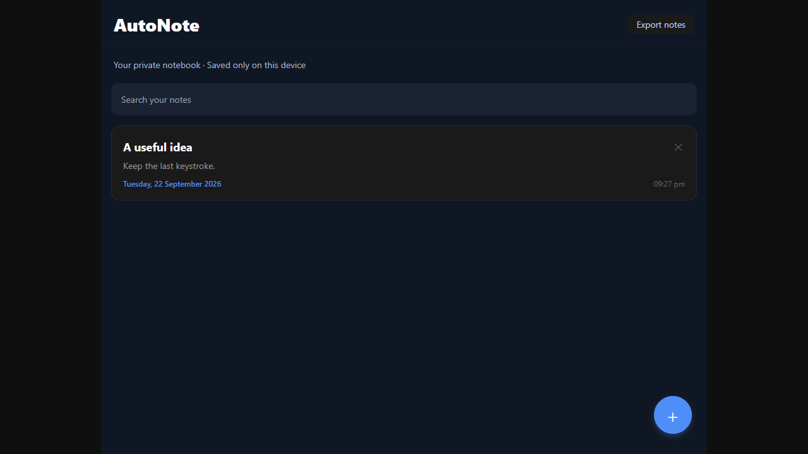

# AutoNote

A focused, timestamped notebook built with Expo, React Native, and Firebase. Write a thought, find it later, and keep your attention on the page.

**[Live demo](https://felimart2003.github.io/auto-note/)** · [Source](https://github.com/felimart2003/auto-note)



## Features

- Create, edit, search, and delete timestamped notes.
- Debounced autosave with visible save feedback and an awaited final save when leaving the editor.
- Zero-configuration local mode: notes stay on the current device using AsyncStorage (browser local storage on web).
- Download a JSON backup of notes on web.
- Optional email/password accounts and real-time Firestore synchronization.
- Responsive dark interface shared across web and native platforms.

## Run locally

Use Node.js 22 and npm.

```sh
npm ci
npm run web
```

The default local mode requires no account, API key, or backend. Clearing browser storage deletes local notes; use Export notes to keep a backup. Local mode is not cloud synchronization and does not encrypt browser storage.

```sh
npm run build
npm test
```

The browser regression suite uses installed Microsoft Edge by default. To use bundled Chromium, install it with `npx playwright install chromium` and set `PLAYWRIGHT_CHANNEL=chromium`. Tests serve the production `dist` output and verify create/edit, immediate navigation, persistence, search, deletion, console errors, and mobile width.

## Optional Firebase configuration

Copy `.env.example` to `.env` and fill all four `EXPO_PUBLIC_FIREBASE_*` values using a Firebase web app. These are public client identifiers, never service-account secrets. Enable Email/Password Authentication, create Firestore, and add your web host to Authentication's authorized domains. Deploy the supplied owner-only security rules and composite index with `firebase deploy --only firestore --project YOUR_PROJECT_ID` using an authenticated Firebase CLI. Rebuild after changing environment values. Incomplete configuration selects local mode.

Native authentication uses AsyncStorage persistence; web uses Firebase browser persistence. Native device builds and a real Firebase project are not covered by the local web regression suite.

## Architecture

`App.js` selects the authenticated navigator. Screens call the note service, which chooses a serialized local-storage adapter or Firestore. The local write queue avoids concurrent read/modify/write overwrites. Firebase rules enforce ownership, immutable ownership on update, and text size limits.

## Deployment

GitHub Pages hosts the free static web export. `.github/workflows/pages.yml` installs locked dependencies, builds, and publishes `dist`. Enable **Settings → Pages → GitHub Actions**. The Expo base path is `/auto-note`; change `expo.experiments.baseUrl` for a different host path. No backend is needed for the public local-mode demo.

## Security and limits

No credentials are committed. Expo SDK 57 and aligned React/native dependencies pass the production web build and browser regression test. `npm audit` reports zero vulnerabilities. A narrowly scoped xcode → uuid override retains the CommonJS v4 API, with an explicit UUID compatibility check. Firebase rules must be deployed before exposing a configured cloud instance. Local data belongs to this browser/device and is not shared between visitors.
